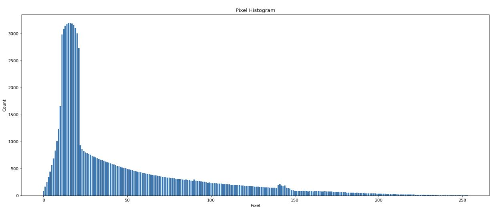

# MPI
  This repository contains 2 implmentation of MPI communications. The first implementation is a calcuation of pixel histagram for a image. The second implementation is of a histagram implementation of words of text.
## Image Histagram
  Counting the pixel count of a particular image. It will ouput a histagram from 0 to 256.
### Tarry Algorithm
  An adjacency matrix is used to represent the map. 
  Start with a root node. 
  1. Send a token down one node. 
  2. if 1 can not be satisfied then send it back to the parent. 
### Solution
  Used MPI to scatter a equal seperate the task. Then I used the tarry algorithm to distribute the taks.
  After the final results are gathered, they are summed so that the histagram is finished.
### Histagram

## Text Search
  Counting the number of occurence of a word in a particular text. It will ouput a histagram of all the written words.
### Ring Algorithm
  An ring is represented by IDs. 
  Start with a root node. 
  1. Send a token down to the next node until it reaches back to the root 
### Solution
  Used MPI to scatter a equal seperate the task. Then I used the Ring algorithm to distribute the taks.
  After the final results are gathered, they are summed so that the result is finished.

